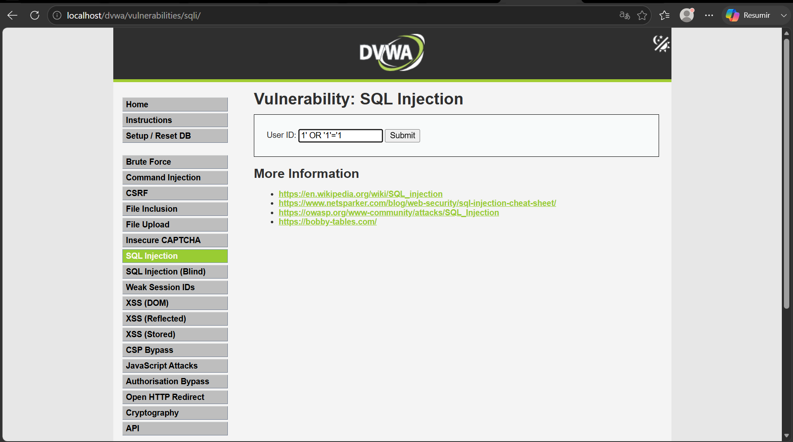
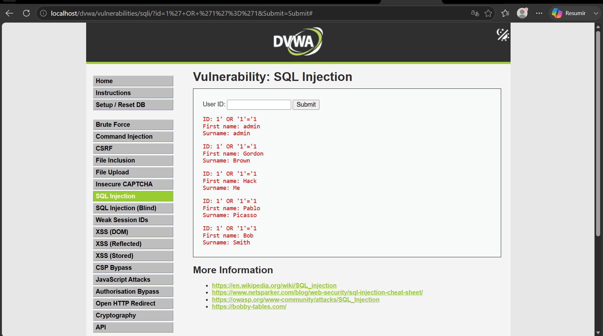

# Vulnerabilidad 01: Inyección SQL (SQLi)

**Clasificación OWASP:** A03:2021-Injection  
**Componente Afectado:** Formulario de Autenticación / Control de Acceso  
**Severidad CVSS v3.1:** 9.8 (Crítico) - `CVSS:3.1/AV:N/AC:L/PR:N/UI:N/S:U/C:H/I:H/A:H`

---

## 1. Evidencias de Explotación

### Fase 1: Payload en Formulario
Se ingresó un vector de ataque clásico lícito-lógico (`1' OR '1'='1`) en el campo de entrada, diseñado para romper la lógica de la consulta SQL subyacente.



### Fase 2: Exposición de Datos (Bypass de Autenticación)
Debido a la falta de sanitización, la aplicación evaluó la sentencia como siempre verdadera (`TRUE`), otorgando acceso ilícito y exponiendo los registros completos de los usuarios administradores y clientes en el entorno de DVWA.



---

## 2. Análisis Técnico
La vulnerabilidad ocurre porque la aplicación web concatena directamente las entradas provistas por el usuario en las sentencias de la base de datos sin ningún tipo de filtrado previo. Esto permite que un atacante altere la estructura original de la consulta SQL ejecutada por el motor, manipulando las validaciones del lado del servidor.

## 3. Políticas y Controles de Mitigación

### Prevención (Mapeo Criterio 3.1.4)
Se prohíbe terminantemente la construcción de consultas SQL dinámicas mediante concatenación de strings basados en parámetros de control del usuario. Toda interacción con la base de datos debe ser tratada de forma aislada.

### Control Implementado (Mapeo Criterio 3.1.5)
Se reestructuró la persistencia empleando **Consultas Parametrizadas (Prepared Statements)**. Al implementar marcadores de posición (`?`), el motor de la base de datos compila la estructura de la consulta antes de insertar los datos del usuario, asegurando que cualquier entrada maliciosa sea tratada estrictamente como un literal de cadena de texto y nunca como código ejecutable.

```javascript
// SOLUCIÓN: Consulta parametrizada segura
const query = "SELECT * FROM usuarios WHERE user = ? AND pass = ?";

db.query(query, [username, password], (err, result) => {
    if (err) return res.status(500).send("Error interno");
    if (result.length > 0) res.send("Autenticado");
});